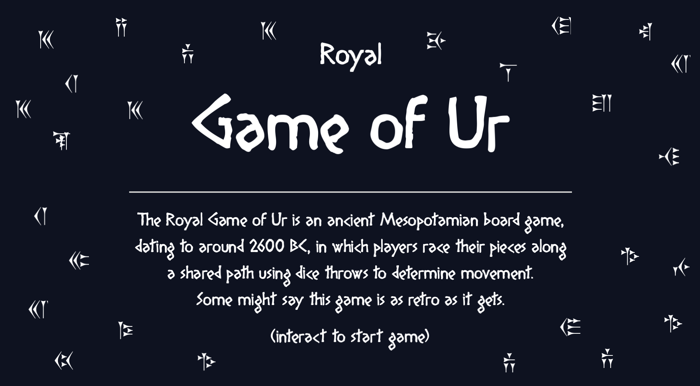
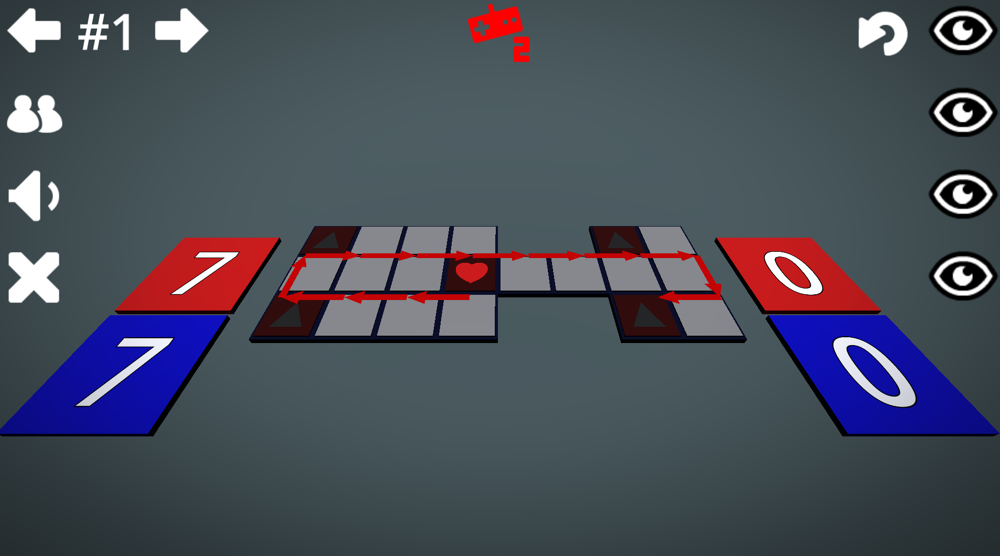
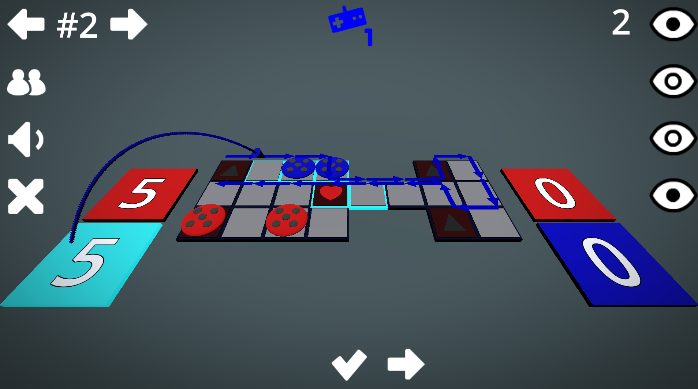
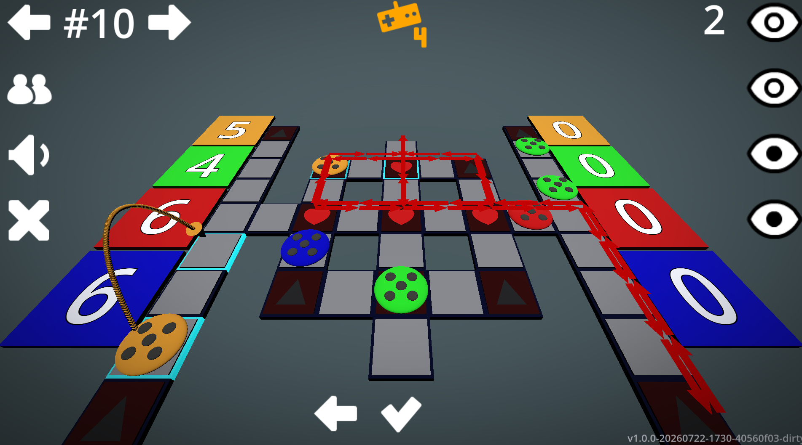

# Royal Game of Ur

info:

  - github: https://github.com/kraasch/game-of-ur
  - itch.io: https://kraasch.itch.io/ur

version:

  - godot version 4.6
  - gdunit4 version 6.1.3

demo:

<table>
  <tr>
    <td></td>
    <td></td>
  </tr>
  <tr>
    <td></td>
    <td></td>
  </tr>
</table>

## creating custom levels

levels are created in code using the `Level.new()` constructor:

```gdscript
Level.new(
    layout,
    tile_definitions,
    player_paths
)
```

### 1. board layout

the first argument is a multiline string describing the board. each character represents a tile, while `-` marks an empty space.

```text
1131-
-232-
-1311
```

### 2. tile definitions

The second argument maps the characters used in the layout to one or more tile effects.

```gdscript
{
    "1": [Tile.TILE_TYPE.REGULAR],
    "2": [Tile.TILE_TYPE.REPEAT],
    "3": [
        Tile.TILE_TYPE.REPEAT,
        Tile.TILE_TYPE.SAFEZONE
    ]
}
```

a tile may have **zero, one or multiple** effects.

### 3. player paths

the final argument defines the movement paths for each player.

```gdscript
[
    [
        "a0,b0,c0,d0,d1,d2,e2",
        "b0,b1,b2,c2",
        "c0,c1,c2,d2",
    ],
    [
        "e2,d2,c2,b2,b1,b0,a0",
        "d2,d1,d0,c0",
        "c2,c1,c0,b0",
    ],
]
```

  - the outer array contains one entry per player (in numeric order: p1, p2, etc).
  - the **first** path is the player's main route.
  - any additional paths are branches that connect to the main path.
  - tiles are referenced by their board coordinates (for example `a0` or `d2`).
  - paths can overlap by using capital letters (for example `C0` or `A0`).

# tasks

what's next

  - [X] hide next/prev arrows when there is no choice (len(draws) == 1).
  - [X] add in shortcuts for button presses.
  - [X] add in controller support.
  - [X] fix visual bugs during piece selection.
  - [X] hide next/prev arrows when there is no choice to left or right(index == 0 or index == len(draws)).
  - [X] unite button input under universal button.
  - [X] fix bug of null reference when playing oen board and then moving to another.
  - [X] filter out draws onto heart tiles as possible moves.
  - [X] arrows above currently selected draw (from from_tile to to_tile).
  - [X] fix tests.
  - [X] visualize player's on-board routes with a graph.
  - [X] only allow controller 1 input for player 1, etc
  - [X] implement feature: overlapping paths are treated like intersections (on second traditional board).
  - [X] make some more levels.

## license

See license file [LICENSE.md](./LICENSE.md).


## credits

See the [License](#license) section.

tools:

  - Godot
    - license: [MIT](https://godotengine.org/license/)
    - location: https://github.com/godotengine/godot

art:

  - Game Icons
    - license: [CC0 1.0](https://creativecommons.org/publicdomain/zero/1.0/)
    - location: https://kenney.nl/assets/game-icons

fonts:

  - Diogenes
    - license:  [100% free]()
    - by:       Apostrophic Labs
    - location: https://www.dafont.com/diogenes.font
  - Zarathustra
    - license:  [free & non-commercial]()
    - location: https://www.dafont.com/zarathustra.font
    - by:       fereydoun23@gmail.com and mr. keyvan mahmmoudi, from the university of teheran
    - note:     unicode, glyphs.
  - Khosrau
    - license:  [free & non-commercial]()
    - location: https://www.dafont.com/khosrau.font
    - by:       fereydoun23@gmail.com and mr. keyvan mahmmoudi, from the university of teheran
    - note:     unicode, glyphs.

music:

  - cc-by 3.0 -- treasures of ancient dungeon and caves.
    - file:      ./godot/assets/music/intro/treasures-of-ancient-dungeon.ogg
    - source:    https://opengameart.org/content/treasures-of-ancient-dungeon-2
    - by:        Alexandr Zhelanov, Monday, November 23, 2015 - 04:31
    - notes:     https://soundcloud.com/alexandr-zhelanov
  - cc-by 3.0 -- Ancient Ruins - Loopable.ogg Ancient Ruins - Loopable.ogg.
    - file:      ./godot/assets/music/game/ancient-ruins.ogg
    - source:    https://opengameart.org/content/ancient-ruins
    - by:        Wolfgang_, Tuesday, November 21, 2017 - 18:54
    - notes:     Copyright/Attribution Notice: Ted Kerr 2017
  - cc-by 3.0 -- The Cave of Ancient Warriors #1a
    - file:      ./godot/assets/music/intro/caves.ogg
    - source:    https://opengameart.org/content/the-cave-of-ancient-warriors-1a-0
    - by:        Bjon12345abc, Sunday, July 24, 2016 - 13:54
    - notes:     Bijan
  - cc-by 4.0 -- Ancient Robot
    - file:      ./godot/assets/music/game/ancient_robot.ogg
    - source:    https://opengameart.org/content/ancient-robot
    - by:        StereoPhysics, Friday, November 6, 2020 - 11:12
    - notes:     Copyright/Attribution Notice: Stereophysics - Enrique Ceseña
  - cc-0 p.d. -- ancient fairytale
    - file:      ./godot/assets/music/game/abf.ogg
    - source:    https://opengameart.org/content/ancient-fairytale
    - by:        obscure music, Friday, August 19, 2016 - 06:12
  - cc-0 p.d. -- Doodle menu like song
    - file:      ./godot/assets/music/game/doodle.ogg
    - source:    https://opengameart.org/content/doodle-menu-like-song
    - by:        StumpyStrust, Wednesday, January 21, 2015 - 08:33
  - cc-0 p.d. -- 7 Assorted Sound Effects (Menu, Level Up)
    - file:      ./godot/assets/music/effects/*
    - source:    https://opengameart.org/content/7-assorted-sound-effects-menu-level-up
    - by:        Joth, Thursday, April 18, 2019 - 09:17
    - notes:     Copyright/Attribution Notice: Joth, opengameart.org/users/joth @Joth_Music twitter.com/Joth_Music
  - cc-0 p.d. -- Tragic ambient main menu
    - file:      ./godot/assets/music/game/ambient-main.ogg
    - source:    https://opengameart.org/content/tragic-ambient-main-menu
    - by:        brandon75689, (Submitted by HaelDB), Tuesday, December 14, 2010 - 23:29

