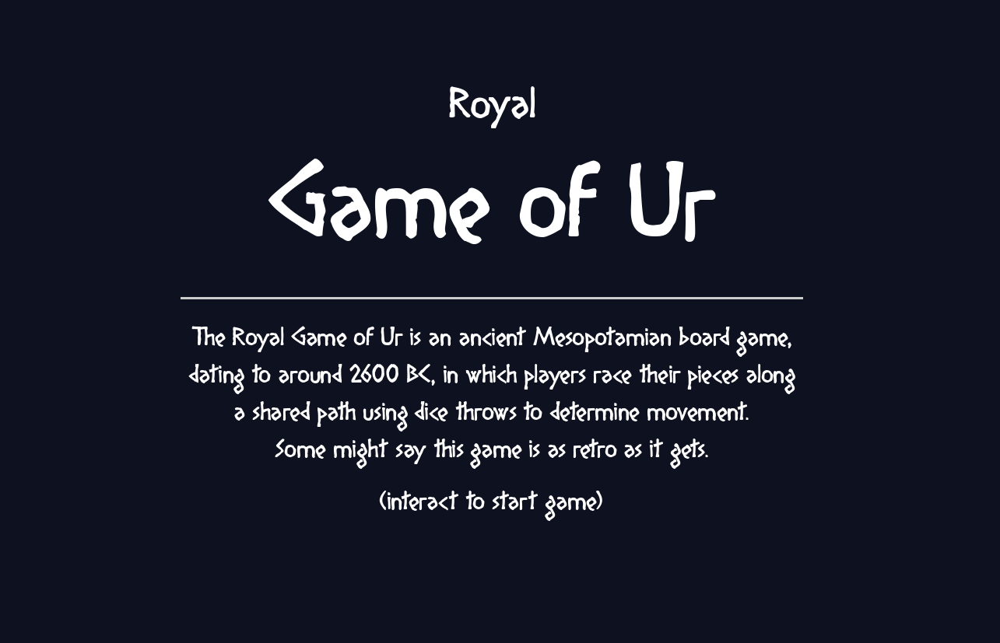
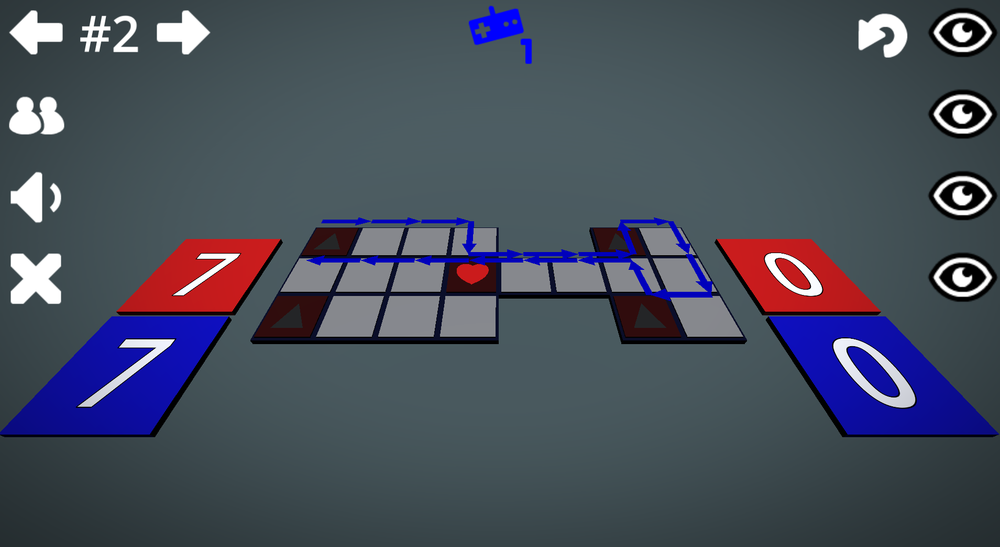
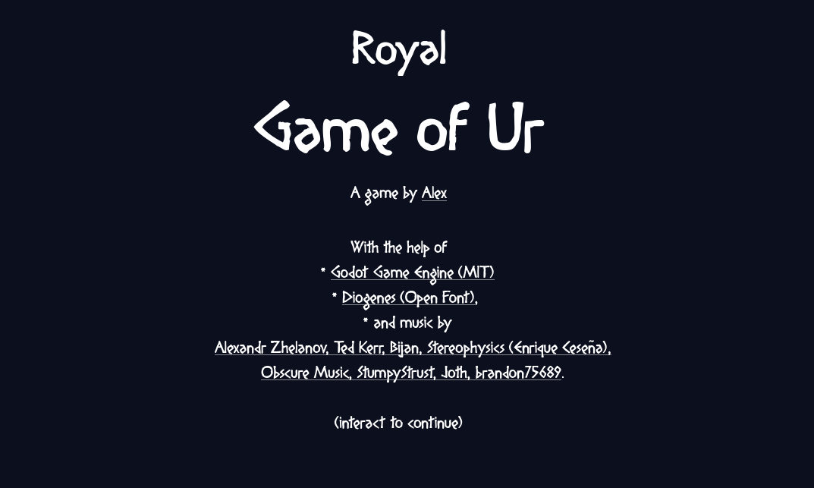

# Royal Game of Ur

info:

  - godot version 4.6
  - gdunit4 version 6.1.3

demo:

<table>
  <tr>
    <td></td>
    <td></td>
  </tr>
  <tr>
    <td></td>
    <td></td>
  </tr>
</table>

known bugs:

  - highlighting pieces to draw does reset properly when switching to next piece to draw.

what's next

  - [ ] fix visual bugs during piece selection.
  - [ ] remove next/prev arrows when there is no choice (len(draws) == 1).
  - [ ] arrows above currently selected draw (from from_tile to to_tile).
  - [ ] visualize player's on-board routes with a graph.

## credits

See license file [LICENSE.md](./LICENSE.md).

tools:

  - Godot
    - license: [MIT](https://godotengine.org/license/)
    - location: https://github.com/godotengine/godot

art:

  - Game Icons
    - license: [CC0 1.0](https://creativecommons.org/publicdomain/zero/1.0/)
    - location: https://kenney.nl/assets/game-icons

fonts:

  - Diogenes
    - license:  [100% free]()
    - location: https://www.dafont.com/diogenes.font

music:

  - cc-by 3.0 -- treasures of ancient dungeon and caves.
    - file:      ./godot/assets/music/intro/treasures-of-ancient-dungeon.ogg
    - source:    https://opengameart.org/content/treasures-of-ancient-dungeon-2
    - by:        Alexandr Zhelanov, Monday, November 23, 2015 - 04:31
    - notes:     https://soundcloud.com/alexandr-zhelanov
  - cc-by 3.0 -- Ancient Ruins - Loopable.ogg Ancient Ruins - Loopable.ogg.
    - file:      ./godot/assets/music/game/ancient-ruins.ogg
    - source:    https://opengameart.org/content/ancient-ruins
    - by:        Wolfgang_, Tuesday, November 21, 2017 - 18:54
    - notes:     Copyright/Attribution Notice: Ted Kerr 2017
  - cc-by 3.0 -- The Cave of Ancient Warriors #1a
    - file:      ./godot/assets/music/intro/caves.ogg
    - source:    https://opengameart.org/content/the-cave-of-ancient-warriors-1a-0
    - by:        Bjon12345abc, Sunday, July 24, 2016 - 13:54
    - notes:     Bijan
  - cc-by 4.0 -- Ancient Robot
    - file:      ./godot/assets/music/game/ancient_robot.ogg
    - source:    https://opengameart.org/content/ancient-robot
    - by:        StereoPhysics, Friday, November 6, 2020 - 11:12
    - notes:     Copyright/Attribution Notice: Stereophysics - Enrique Ceseña
  - cc-0 p.d. -- ancient fairytale
    - file:      ./godot/assets/music/game/abf.ogg
    - source:    https://opengameart.org/content/ancient-fairytale
    - by:        obscure music, Friday, August 19, 2016 - 06:12
  - cc-0 p.d. -- Doodle menu like song
    - file:      ./godot/assets/music/game/doodle.ogg
    - source:    https://opengameart.org/content/doodle-menu-like-song
    - by:        StumpyStrust, Wednesday, January 21, 2015 - 08:33
  - cc-0 p.d. -- 7 Assorted Sound Effects (Menu, Level Up)
    - file:      ./godot/assets/music/effects/*
    - source:    https://opengameart.org/content/7-assorted-sound-effects-menu-level-up
    - by:        Joth, Thursday, April 18, 2019 - 09:17
    - notes:     Copyright/Attribution Notice: Joth, opengameart.org/users/joth @Joth_Music twitter.com/Joth_Music
  - cc-0 p.d. -- Tragic ambient main menu
    - file:      ./godot/assets/music/game/ambient-main.ogg
    - source:    https://opengameart.org/content/tragic-ambient-main-menu
    - by:        brandon75689, (Submitted by HaelDB), Tuesday, December 14, 2010 - 23:29

